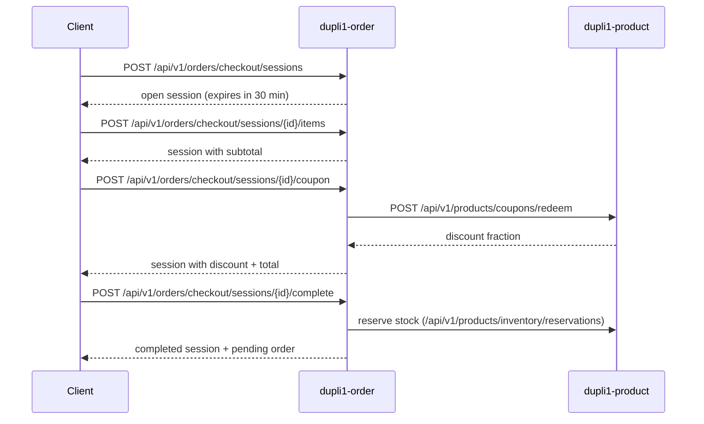

# Checkout Session

Checkout sessions provide a multi-step purchase flow inside the **order service** (`dupli1-order`). A client builds a cart-like session, optionally applies a coupon, then completes checkout to create a pending order with inventory reserved.

For a **persistent** shopping cart (saved across sessions), use the **cart service** first — see [cart-service.md](cart-service.md).

For **payment** after checkout, see [payment-service.md](payment-service.md) (NANO card / Bypass; 5-minute unpaid window).

Recipient name, phone, and shipping address are snapshotted on checkout **complete** (optional prefill from auth profile) — see [auth-profile-extension-plan.md](auth-profile-extension-plan.md).

Direct order creation (`POST /api/v1/orders`) remains available for callers that already have a finalized cart.

## Flow



Stock and reservations are owned by the product service (merged in from the
former standalone inventory service). Order calls them through the **internal
API gateway** (`DUPLI1_GATEWAY_URL`) using canonical paths
`/api/v1/products/inventory/...` and `/api/v1/products/coupons/...` (legacy
`/api/v1/inventory/...` and `/api/v1/coupons/...` still work via gateway aliases).
Deprecated: `DUPLI1_PRODUCT_URL` / `DUPLI1_INVENTORY_URL` as direct product overrides.

## Session states

| Status | Meaning |
|--------|---------|
| `open` | Session accepts item and coupon changes |
| `completed` | Checkout finished; `order_id` is set |
| `expired` | `expires_at` passed; session is read-only |

Default TTL is **30 minutes** (`domain.DefaultCheckoutTTL`).

## API

**Canonical** base path: `/api/v1/orders/checkout/sessions` on `dupli1-order` (port **8083** locally).  
Legacy alias `/api/v1/checkout/sessions…` remains registered until clients migrate ([TODO.md](TODO.md)).

### `POST /api/v1/orders/checkout/sessions`

Create an empty checkout session.

**Request**
```json
{ "customer_id": "03f95d58-4840-46d4-9c92-fe48364d2e75" }
```

**Response `201`**
```json
{
  "id": "cs_000001",
  "customer_id": "03f95d58-4840-46d4-9c92-fe48364d2e75",
  "items": [],
  "status": "open",
  "subtotal_cents": 0,
  "discount_cents": 0,
  "shipping_fee_cents": 30000,
  "total_cents": 0,
  "expires_at": "2026-06-21T12:30:00Z",
  "created_at": "2026-06-21T12:00:00Z",
  "updated_at": "2026-06-21T12:00:00Z"
}
```

**Pricing.** `total_cents = subtotal_cents - discount_cents + shipping_fee_cents`.

`shipping_fee_cents` is the flat delivery charge quoted for this session (whole KRW, from `DUPLI1_ORDER_SHIPPING_FEE_CENTS`, default 30000; set 0 for free delivery). It is fixed when the session opens, and `complete` charges that quoted amount even if the configured fee changed mid-checkout. Direct `POST /api/v1/orders` (no session) uses the current configured fee.

A session with **no items** quotes `total_cents: 0` even while `shipping_fee_cents` is non-zero, as above — an empty cart owes nothing to ship. The charge enters the total once the session holds at least one item, and drops out again if every item is removed.

A coupon discounts goods only, so the total never falls below the delivery charge.

---

### `GET /api/v1/orders/checkout/sessions/{id}`

Fetch the current session. Expired open sessions are marked `expired` on read.

**Response `200`** — session object (same shape as above, with items when present).

On read, the service re-checks each stored line against the product catalog. Lines that are no longer sellable stay in `items` with `available: false` and are listed in top-level `unavailable_items` (same shape as cart). `unavailable_items` is omitted when every line resolves.

---

### `PUT /api/v1/orders/checkout/sessions/{id}/items`

Replace all line items. Server resolves prices from product (client `unit_price_cents` is ignored).

**Request**
```json
{
  "items": [
    { "sku": "bag-1", "quantity": 2 }
  ]
}
```

**Response `200`** — updated session with recalculated `subtotal_cents` and `total_cents` (catalog prices).

Batch replace validates **all** lines. Missing variants return **`422`**:

```json
{
  "error": "variant not found",
  "code": 422,
  "unavailable_items": [
    { "sku_id": "01JAY…", "sku": "BAG-GONE", "reason": "variant_not_found" }
  ]
}
```

---

### `POST /api/v1/orders/checkout/sessions/{id}/items`

Add or update a single line item (matched by `sku`). Server resolves price from product.

**Request**
```json
{ "sku": "bag-1", "quantity": 1 }
```

**Response `200`** — updated session.

Unknown / inactive variants return the same **`422`** + `unavailable_items` body as `PUT …/items`.
---

### `DELETE /api/v1/orders/checkout/sessions/{id}/items/{sku}`

Remove a line item.

**Response `200`** — updated session.

---

### `POST /api/v1/orders/checkout/sessions/{id}/coupon`

Apply a coupon by redeeming it from the product service.

**Request**
```json
{ "code": "SUMMER30" }
```

**Response `200`** — session with `coupon_code`, `discount_cents`, and `total_cents` updated.

Requires `DUPLI1_PRODUCT_URL` to be configured. Returns `503` when the coupon client is unavailable.

---

### `POST /api/v1/orders/checkout/sessions/{id}/complete`

Finalize checkout: reserve inventory, create a `pending` order with **fulfillment snapshot**, and mark the session `completed`.

**Request body** (required)
```json
{
  "recipient_name": "윤라희",
  "recipient_phone": "01041125167",
  "shipping_address": {
    "postal_code": "06194",
    "address_line1": "테헤란로 78길 14-12",
    "address_line2": "9층",
    "city": "강남구",
    "province": "서울특별시",
    "pccc": "P123456789012"
  },
  "address_id": "addr_000001"
}
```

`address_id` is optional audit metadata when the client copied from auth profile; the order stores the snapshot fields, not a live reference.

`shipping_address.pccc` is optional — the Korea Personal Customs Clearance Code (`P` + 12 digits) required by carriers to clear an overseas-purchase shipment through Korean customs. Omit it for domestic-sourced items.

**Response `200`**
```json
{
  "session": {
    "id": "cs_000001",
    "status": "completed",
    "order_id": "ord_000001",
    "coupon_code": "SUMMER30",
    "subtotal_cents": 10000,
    "discount_cents": 3000,
    "shipping_fee_cents": 30000,
    "total_cents": 37000
  },
  "order": {
    "id": "ord_000001",
    "customer_id": "03f95d58-4840-46d4-9c92-fe48364d2e75",
    "status": "pending",
    "recipient_name": "윤라희",
    "recipient_phone": "01041125167",
    "shipping_address": {
      "postal_code": "06194",
      "address_line1": "테헤란로 78길 14-12",
      "address_line2": "9층",
      "city": "강남구",
      "province": "서울특별시",
      "pccc": "P123456789012"
    },
    "source_address_id": "addr_000001",
    "coupon_code": "SUMMER30",
    "subtotal_cents": 10000,
    "discount_cents": 3000,
    "shipping_fee_cents": 30000,
    "total_cents": 37000,
    "items": [
      { "sku": "BAG-1", "quantity": 2, "unit_price_cents": 5000 }
    ]
  }
}
```

After completion, the order is **`pending`** with inventory reserved. The customer must pay within **5 minutes** via the payment service (NANO card or manager Bypass); see [payment-service.md](payment-service.md). Only `dupli1-payment` confirms the order after a successful payment — not manual status updates.

When completion fails because one or more session lines no longer resolve to sellable variants, the response is **`422`** with `error: "variant not found"` and `unavailable_items` (same shape as cart / item mutations). This is distinct from empty cart, expired session, or stock exhaustion.

## Concurrency and idempotency

`POST …/complete` tolerates concurrent or duplicate calls:

1. The service creates a `pending` order and reserves stock.
2. `CompleteCheckoutSessionIfOpen` atomically marks the session `completed` only when status is still `open`.
3. If the claim fails (session already completed or no longer open), the new order is **canceled** and stock is released; the client gets **`400`** (`checkout session is not open`).

After a successful complete, read `GET …/sessions/{id}` for the `order_id` — do not call `complete` again.

Direct order create (`POST /api/v1/orders`) supports optional `Idempotency-Key` for replay-safe creates; checkout complete does not use that header.

## Configuration

| Variable | Default | Description |
|----------|---------|-------------|
| `DUPLI1_ORDER_ADDR` | `:8083` | Listen address |
| `DUPLI1_GATEWAY_URL` | `http://localhost:8080` | Internal nginx gateway (stock + coupons) |
| `DUPLI1_AUTH_URL` | — | Auth base for service-account login (prefer direct; gateway OK after proxy is up) |
| `DUPLI1_PRODUCT_URL` | — | **Deprecated** direct product override |
| `DUPLI1_INVENTORY_URL` | — | **Deprecated** alias for product override |

## Errors

| Status | Condition |
|--------|-----------|
| `400` | Invalid input, empty checkout, expired session, invalid coupon, duplicate `complete` on non-open session |
| `404` | Session not found |
| `422` | Variant not sellable on item mutations or `complete` — body includes `unavailable_items` |
| `503` | Coupon service not configured |
| `500` | Inventory or persistence failure |

## Package layout

| Path | Role |
|------|------|
| `order/pkg/domain/checkout_session.go` | Session entity and totals logic |
| `order/pkg/service/checkout.go` | Use cases |
| `order/pkg/ports/repository.go` | Order and checkout session persistence |
| `order/pkg/ports/coupon.go` | Coupon redemption port |
| `order/pkg/infra/httpcoupon/` | Product service HTTP adapter |
| `order/pkg/handler/checkout.go` | HTTP routes |

Order and checkout routes require `Authorization: Bearer <access_token>` when `AUTH_JWKS_URL` or `JWT_SECRET` is configured (RS256 via auth JWKS when set).
